# SAHRA Blueprint — 03: System Architecture

*All diagrams in Mermaid. The architecture shown is the recommended hybrid (doc 08): Flutter → NestJS modular monolith → Supabase PostgreSQL + Redis, with Firebase for FCM/Analytics/Crashlytics.*

---

## 1. High-Level System Architecture

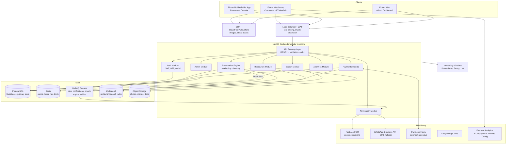

## 2. Component Diagram

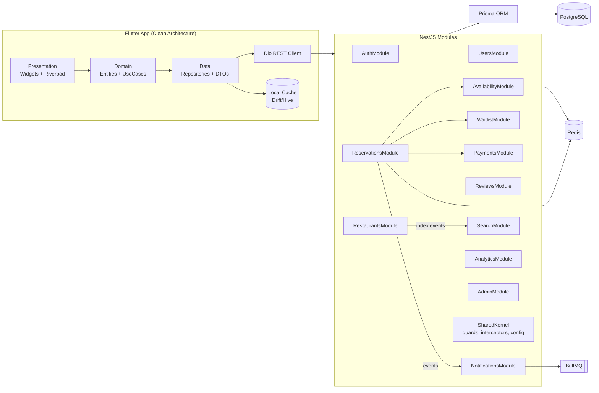

## 3. Deployment Diagram (Growth stage)

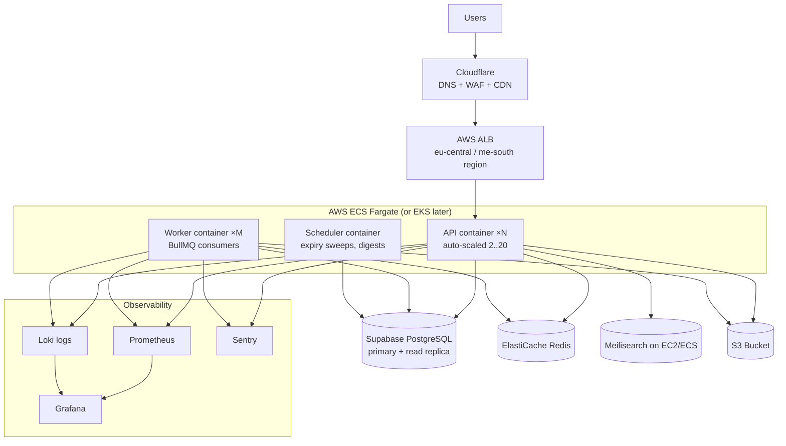

## 4. Network Diagram

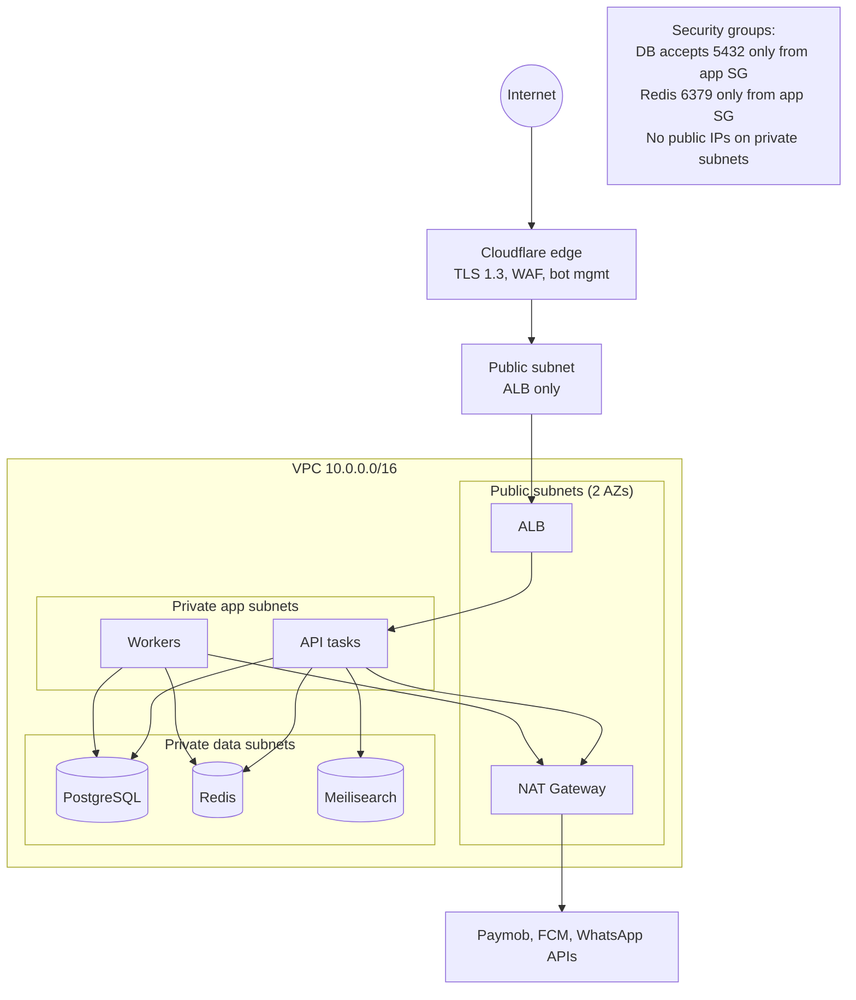

## 5. Data Flow Diagram (booking a table)

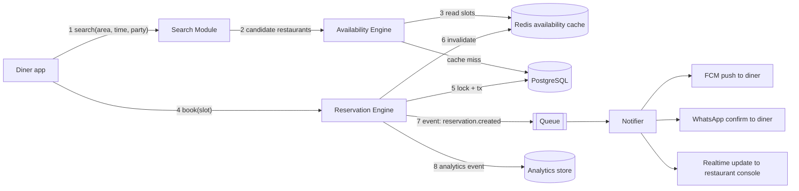

## 6. Sequence Diagrams

### 6.1 User Registration (phone OTP + email)

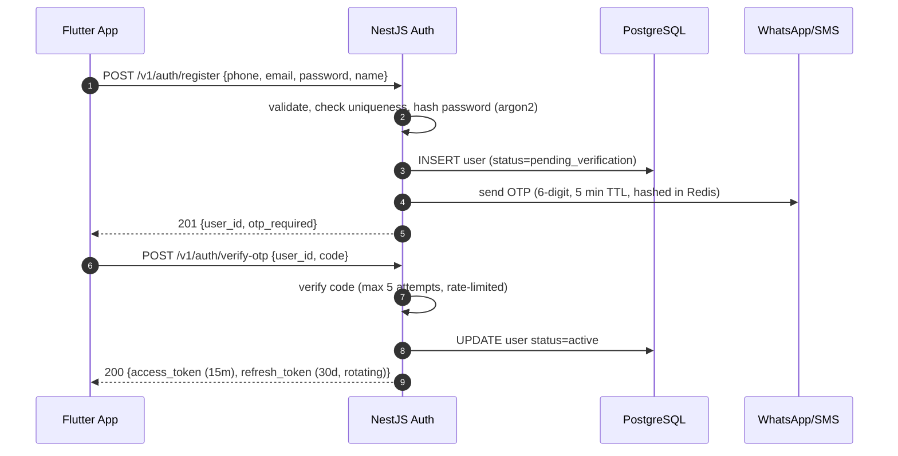

### 6.2 Restaurant Registration & Approval

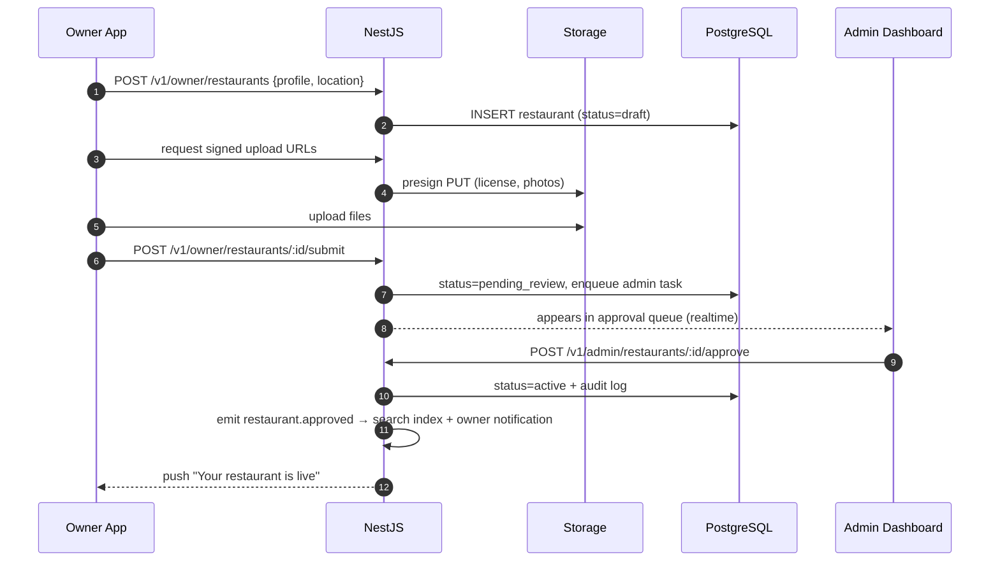

### 6.3 Reservation Creation (happy path with hold)

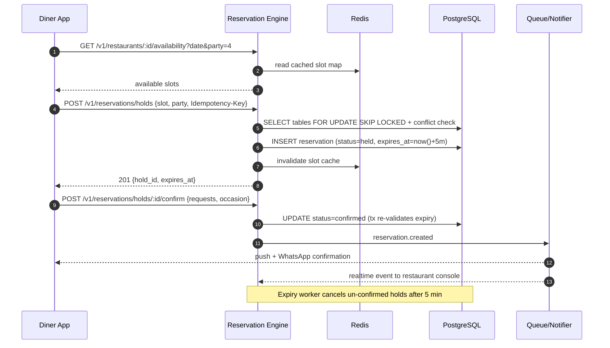

### 6.4 Reservation Cancellation

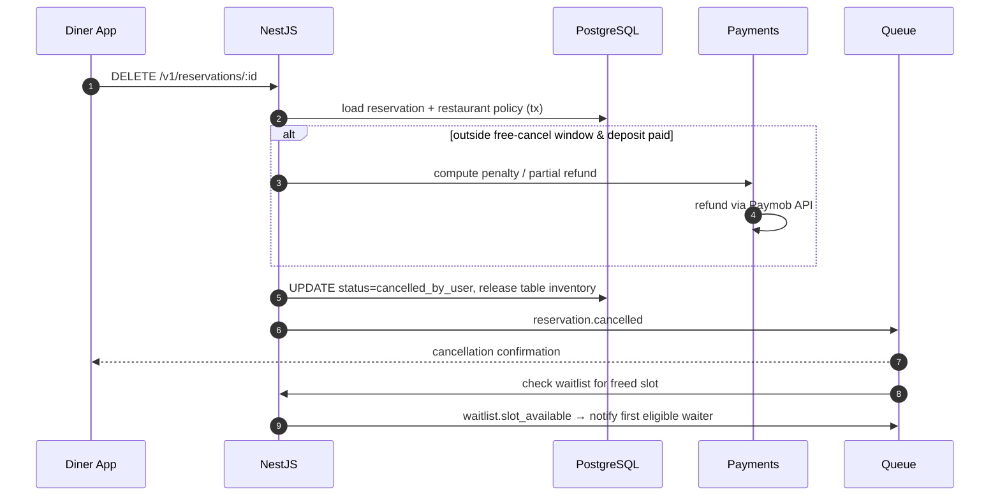

### 6.5 Payment Processing (deposit via Paymob)

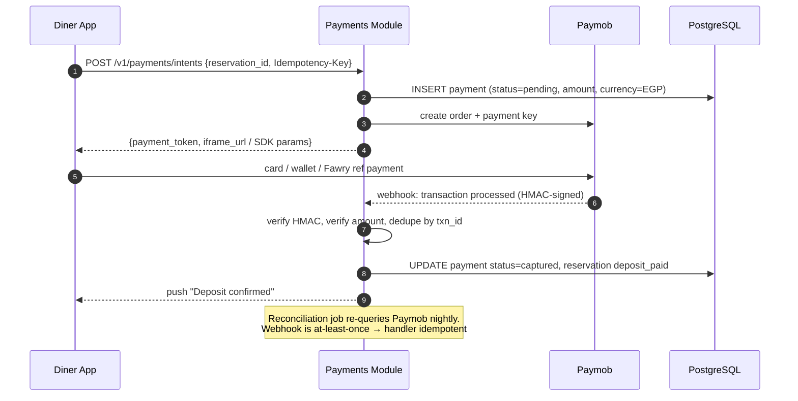

### 6.6 Push Notification Pipeline

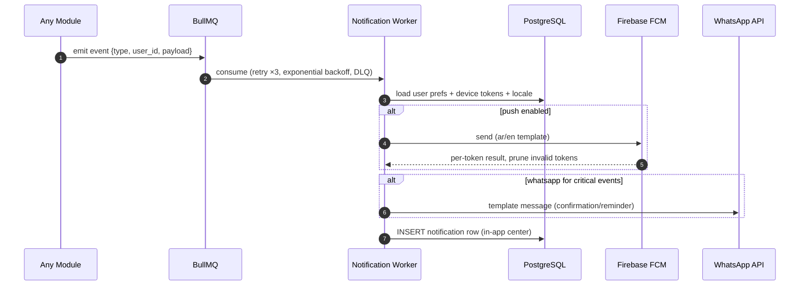

### 6.7 Waitlist Flow

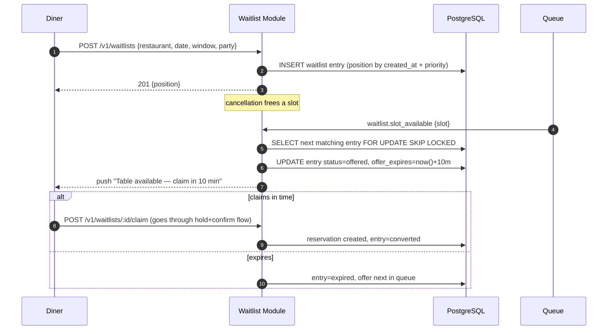

### 6.8 Review Submission

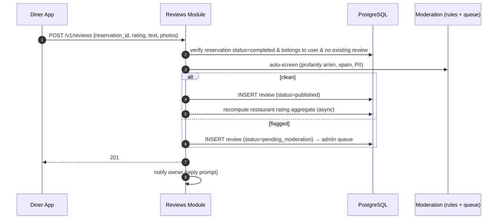
