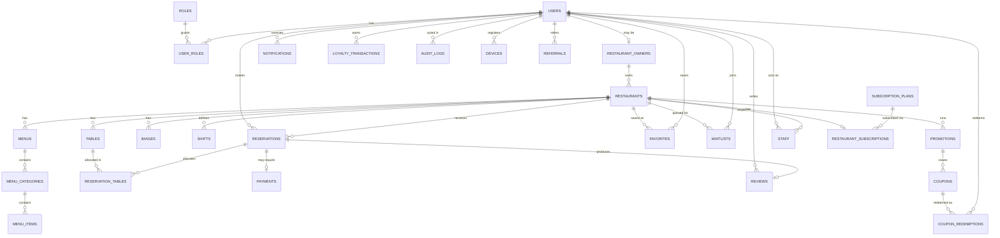

# SAHRA Blueprint — 04: Database Design

*PostgreSQL 16 (Supabase). Conventions: `id UUID PK DEFAULT gen_random_uuid()`, `created_at/updated_at TIMESTAMPTZ NOT NULL DEFAULT now()` on every table (omitted below for brevity), soft delete via `deleted_at` only where noted, all money as `NUMERIC(12,2)` + `currency CHAR(3) DEFAULT 'EGP'`, all user-facing text bilingual (`name_en`, `name_ar`).*

---

## 1. ER Diagram



## 2. Table Definitions

### users
| Field | Type | Constraints |
|---|---|---|
| id | UUID | PK |
| email | CITEXT | UNIQUE, NULLABLE (phone-only users) |
| phone | VARCHAR(20) | UNIQUE, E.164, NOT NULL |
| password_hash | TEXT | NULLABLE (social/OTP-only) |
| full_name | VARCHAR(120) | NOT NULL |
| avatar_url | TEXT | |
| locale | CHAR(2) | DEFAULT 'ar', CHECK IN ('ar','en') |
| status | user_status ENUM | 'pending','active','suspended','deleted' |
| email_verified_at / phone_verified_at | TIMESTAMPTZ | |
| no_show_count | SMALLINT | DEFAULT 0 |
| referral_code | VARCHAR(10) | UNIQUE |
| referred_by | UUID | FK → users.id, NULLABLE |
| marketing_opt_in | BOOLEAN | DEFAULT false |
| deleted_at | TIMESTAMPTZ | soft delete (PDPL erasure anonymizes PII) |

Indexes: `UNIQUE(email)`, `UNIQUE(phone)`, `UNIQUE(referral_code)`, `idx_users_status`.

### roles / user_roles
`roles(id SMALLSERIAL PK, name VARCHAR(30) UNIQUE)` — 'customer','owner','admin','support','moderator'.
`user_roles(user_id FK→users ON DELETE CASCADE, role_id FK→roles, granted_by FK→users, PRIMARY KEY(user_id, role_id))`. Index: `idx_user_roles_role`.

### restaurant_owners
| Field | Type | Constraints |
|---|---|---|
| id | UUID | PK |
| user_id | UUID | UNIQUE FK → users |
| business_name | VARCHAR(160) | NOT NULL |
| tax_id | VARCHAR(40) | |
| verification_status | ENUM | 'pending','verified','rejected' |
| verified_at / verified_by | TIMESTAMPTZ / FK→users | |

### restaurants
| Field | Type | Constraints |
|---|---|---|
| id | UUID | PK |
| owner_id | UUID | FK → restaurant_owners, NOT NULL |
| slug | VARCHAR(80) | UNIQUE |
| name_en / name_ar | VARCHAR(160) | NOT NULL |
| description_en / description_ar | TEXT | |
| cuisines | TEXT[] | GIN-indexed |
| phone / email / website | | |
| address_en / address_ar | TEXT | |
| neighborhood | VARCHAR(80) | e.g., 'Zamalek' |
| city | VARCHAR(80) | DEFAULT 'Cairo' |
| location | GEOGRAPHY(POINT,4326) | NOT NULL (PostGIS) |
| price_band | SMALLINT | CHECK 1–4 |
| amenities | JSONB | outdoor, family_section, shisha, valet, view… |
| policies | JSONB | cancel_window_hours, deposit_required, deposit_amount, kids… |
| booking_mode | ENUM | 'instant','request' |
| slot_interval_min | SMALLINT | DEFAULT 30 |
| pacing_limit | SMALLINT | max new covers per interval, NULLABLE |
| rating_avg | NUMERIC(3,2) | DEFAULT 0 (denormalized) |
| rating_count | INT | DEFAULT 0 |
| status | ENUM | 'draft','pending_review','active','suspended','closed' |
| timezone | VARCHAR(40) | DEFAULT 'Africa/Cairo' |
| deleted_at | TIMESTAMPTZ | |

Indexes: `UNIQUE(slug)`, `GIST(location)`, `GIN(cuisines)`, `idx_restaurants_status_neighborhood(status, city, neighborhood)`, partial `idx_restaurants_active ON (status) WHERE status='active'`.

### shifts (service periods & hours)
| Field | Type | Constraints |
|---|---|---|
| id | UUID | PK |
| restaurant_id | UUID | FK → restaurants ON DELETE CASCADE |
| name_en / name_ar | VARCHAR(60) | 'Dinner', 'Iftar', 'Sohour' |
| day_of_week | SMALLINT | 0–6; NULL when date-specific |
| specific_date | DATE | NULL for weekly rows |
| opens_at / closes_at | TIME | closes_at may be past midnight (stored with `spans_midnight BOOLEAN`) |
| default_turn_minutes | JSONB | {"1-2":90,"3-4":105,"5+":120} |
| is_ramadan | BOOLEAN | DEFAULT false — iftar shifts auto-anchor to Maghrib |
| active | BOOLEAN | DEFAULT true |

Index: `idx_shifts_rest_dow(restaurant_id, day_of_week)`, `idx_shifts_rest_date(restaurant_id, specific_date)`. CHECK: exactly one of `day_of_week` / `specific_date` set.

### tables
| Field | Type | Constraints |
|---|---|---|
| id | UUID | PK |
| restaurant_id | UUID | FK → restaurants ON DELETE CASCADE |
| name | VARCHAR(30) | e.g., 'T12'; UNIQUE(restaurant_id, name) |
| min_capacity / max_capacity | SMALLINT | CHECK min ≤ max, max ≤ 30 |
| zone | ENUM | 'indoor','outdoor','family','bar','private' |
| combinable_with | UUID[] | adjacent table ids |
| priority | SMALLINT | allocation preference (lower = assign first) |
| active | BOOLEAN | DEFAULT true |

Index: `idx_tables_rest_capacity(restaurant_id, max_capacity) WHERE active`.

### reservations — *the hot table*
| Field | Type | Constraints |
|---|---|---|
| id | UUID | PK |
| code | VARCHAR(8) | UNIQUE, human-readable (e.g., 'SAH-7K2M') |
| restaurant_id | UUID | FK → restaurants, NOT NULL |
| user_id | UUID | FK → users, NULLABLE (walk-in/phone) |
| guest_name / guest_phone | VARCHAR | for non-app bookings |
| party_size | SMALLINT | CHECK 1–50 |
| starts_at | TIMESTAMPTZ | NOT NULL |
| ends_at | TIMESTAMPTZ | NOT NULL, = starts_at + turn time |
| status | ENUM | 'held','pending','confirmed','seated','completed','no_show','cancelled_by_user','cancelled_by_restaurant','expired' |
| source | ENUM | 'app','walk_in','phone','waitlist','admin' |
| special_requests | TEXT | |
| occasion | VARCHAR(40) | |
| seating_pref | ENUM | zone values, NULLABLE |
| hold_expires_at | TIMESTAMPTZ | NULLABLE (held status only) |
| idempotency_key | UUID | UNIQUE, NULLABLE |
| deposit_payment_id | UUID | FK → payments, NULLABLE |
| cancelled_at / cancel_reason | | |
| version | INT | DEFAULT 0 — optimistic-lock counter |

Indexes: `UNIQUE(code)`, `UNIQUE(idempotency_key)`, `idx_resv_rest_time(restaurant_id, starts_at)` — the workhorse; `idx_resv_user(user_id, starts_at DESC)`; partial `idx_resv_active(restaurant_id, starts_at) WHERE status IN ('held','pending','confirmed','seated')` — availability checks scan only live rows; `idx_resv_hold_expiry(hold_expires_at) WHERE status='held'` — expiry sweeps.

### reservation_tables (join — supports table combinations)
`reservation_id FK→reservations ON DELETE CASCADE, table_id FK→tables, PRIMARY KEY(reservation_id, table_id)`.
Index: `idx_restable_table(table_id)`.
**Anti-double-booking constraint (belt-and-suspenders beneath the application lock):**
```sql
ALTER TABLE reservation_tables ADD COLUMN during TSTZRANGE NOT NULL;
CREATE EXTENSION IF NOT EXISTS btree_gist;
ALTER TABLE reservation_tables ADD CONSTRAINT no_table_overlap
  EXCLUDE USING GIST (table_id WITH =, during WITH &&)
  WHERE (active); -- active flag mirrored from reservation status by trigger
```

### payments
| Field | Type | Constraints |
|---|---|---|
| id | UUID | PK |
| user_id | UUID | FK → users |
| restaurant_id | UUID | FK → restaurants |
| reservation_id | UUID | FK → reservations, NULLABLE (subscriptions too) |
| kind | ENUM | 'deposit','event_ticket','subscription','refund' |
| amount | NUMERIC(12,2) | CHECK > 0 |
| currency | CHAR(3) | DEFAULT 'EGP' |
| provider | ENUM | 'paymob','fawry','cash','apple_pay' |
| provider_txn_id | VARCHAR(80) | UNIQUE per provider |
| status | ENUM | 'pending','authorized','captured','failed','refunded','partially_refunded' |
| idempotency_key | UUID | UNIQUE |
| raw_webhook | JSONB | last provider payload (audit) |

Indexes: `UNIQUE(provider, provider_txn_id)`, `idx_pay_user`, `idx_pay_resv`, `idx_pay_status_created(status, created_at)` for reconciliation.

### reviews
| Field | Type | Constraints |
|---|---|---|
| id | UUID | PK |
| reservation_id | UUID | UNIQUE FK → reservations (one review per visit, verified-diner guarantee) |
| user_id / restaurant_id | UUID | FKs, NOT NULL |
| rating | SMALLINT | CHECK 1–5 |
| food_rating / service_rating / ambience_rating | SMALLINT | NULLABLE 1–5 |
| body | TEXT | ≤ 2000 chars |
| status | ENUM | 'published','pending_moderation','rejected','removed' |
| owner_reply | TEXT | + owner_replied_at |

Indexes: `idx_reviews_rest(restaurant_id, status, created_at DESC)`, `idx_reviews_user`.

### menus / menu_categories / menu_items
`menus(id, restaurant_id FK CASCADE, name_en/ar, kind ENUM('food','drinks','ramadan','set'), pdf_url TEXT NULL, position SMALLINT, active BOOL)`
`menu_categories(id, menu_id FK CASCADE, name_en/ar, position SMALLINT)`
`menu_items(id, category_id FK CASCADE, name_en/ar, description_en/ar, price NUMERIC(12,2), currency, image_id FK→images NULL, dietary_tags TEXT[], available BOOL, position SMALLINT)`

> **PRECEDENT — every money column is `NUMERIC(12,2)`.** This line said `(10,2)`, which contradicted CLAUDE.md rule 5. `menu_items.price` was the FIRST money column built, so the width it took is the one `payments.amount`, deposits, settlement and commission are all copied from. Corrected 2026-08-09; the argument is in `docs/decisions/2026-08-09-group-d-schema-proposal.md` §1.2 and does not need making again.

> `dietary_tags` is constrained to a fixed vocabulary by a CHECK — an unconstrained typo does not fail, it disappears at render time. The list is in the migration.
Indexes: position-ordered fetch per parent: `idx_mi_cat(category_id, position)`.

### images (polymorphic media)
`id, owner_type ENUM('restaurant','menu_item','review','user'), owner_id UUID, url TEXT, blurhash VARCHAR(50), width/height INT, position SMALLINT, is_cover BOOL, status ENUM('processing','ready','rejected')`.
Index: `idx_images_owner(owner_type, owner_id, position)`.

### notifications
`id, user_id FK, type VARCHAR(40), title_en/ar, body_en/ar, data JSONB, channels TEXT[] ('push','whatsapp','sms','email'), read_at TIMESTAMPTZ, sent_at TIMESTAMPTZ`.
Index: `idx_notif_user_unread(user_id, created_at DESC) WHERE read_at IS NULL`. Partitioned by month at scale.

### devices
`id, user_id FK CASCADE, fcm_token TEXT UNIQUE, platform ENUM('ios','android','web'), app_version, last_seen_at`. Index on user_id.

### promotions / coupons / coupon_redemptions
`promotions(id, restaurant_id FK NULL — NULL = platform-wide, name_en/ar, kind ENUM('percent_off','fixed_off','event','offpeak'), value NUMERIC, starts_at/ends_at TIMESTAMPTZ, constraints JSONB (days, hours, min_party), status)`
`coupons(id, promotion_id FK CASCADE, code VARCHAR(20) UNIQUE, max_redemptions INT, per_user_limit SMALLINT DEFAULT 1, redeemed_count INT DEFAULT 0)`
`coupon_redemptions(id, coupon_id FK, user_id FK, reservation_id FK, UNIQUE(coupon_id, user_id, reservation_id))`
Redemption check runs in the booking transaction with `SELECT … FOR UPDATE` on the coupon row.

### staff
`id, restaurant_id FK CASCADE, user_id FK, role ENUM('manager','host','viewer'), permissions JSONB, invited_by FK→users, status ENUM('invited','active','revoked'), UNIQUE(restaurant_id, user_id)`.

### subscription_plans / restaurant_subscriptions
`subscription_plans(id SMALLSERIAL, name ('basic','pro'), price_monthly NUMERIC, currency, features JSONB, active BOOL)`
`restaurant_subscriptions(id, restaurant_id UNIQUE FK, plan_id FK, status ENUM('trialing','active','past_due','cancelled'), current_period_start/end, payment_method JSONB)`
Index: `idx_subs_status_period(status, current_period_end)` for renewal jobs.

### waitlists
| Field | Type | Constraints |
|---|---|---|
| id | UUID | PK |
| restaurant_id / user_id | UUID | FKs NOT NULL |
| desired_date | DATE | NOT NULL |
| window_start / window_end | TIMESTAMPTZ | acceptable range |
| party_size | SMALLINT | |
| status | ENUM | 'waiting','offered','converted','expired','cancelled' |
| offer_expires_at | TIMESTAMPTZ | NULLABLE |
| priority | SMALLINT | DEFAULT 0 (loyalty tier boost later) |

Indexes: `idx_wait_rest_date(restaurant_id, desired_date, status)`, partial on `status='offered'` for expiry sweep. UNIQUE(restaurant_id, user_id, desired_date) prevents duplicates.

### loyalty_transactions
`id, user_id FK, kind ENUM('earn','redeem','expire','adjust'), points INT (signed), reservation_id FK NULL, balance_after INT, note`.
Index `idx_loyalty_user(user_id, created_at DESC)`. Balance = latest `balance_after` (also cached on users row by trigger).

### referrals
`id, referrer_id FK→users, referee_id UNIQUE FK→users, status ENUM('pending','qualified','rewarded','rejected'), qualified_reservation_id FK NULL`.

### audit_logs (append-only)
`id BIGSERIAL PK, actor_id FK→users NULL, actor_role, action VARCHAR(60), entity_type, entity_id UUID, before JSONB, after JSONB, ip INET, user_agent TEXT, created_at`.
No UPDATE/DELETE grants to app role. Partitioned by month. Indexes: `(entity_type, entity_id)`, `(actor_id, created_at DESC)`.

## 3. Why This Design Is Optimized

**Correctness first where it pays for itself.** Double-booking is the one bug that kills a reservation platform's credibility with restaurants; the schema enforces it at *three* levels — application locks (doc 05), the transactional conflict re-check, and the PostgreSQL `EXCLUDE USING GIST` range constraint that makes an overlapping allocation physically unstorable even if application code regresses.

**Hot-path shape.** Availability = "which tables at restaurant X are free in range R". `idx_resv_active` (partial index on live statuses) means the planner touches only tonight's live bookings, not years of history. `reservations` stays narrow; cold text lives on the row but big blobs (webhooks, images) live elsewhere.

**Denormalization only where read volume dwarfs write volume:** `rating_avg`/`rating_count` on restaurants (recomputed async on review events), loyalty balance cache. Everything else stays normalized to keep writes cheap and consistent.

**Bilingual by column, not by join.** `name_en`/`name_ar` columns beat a translations table at this scale — one row fetch renders either locale, and search indexes both.

**Time correctness.** All timestamps `TIMESTAMPTZ`; restaurant-local logic derives from the restaurant's `timezone`. Ramadan shifts flagged so iftar slots re-anchor to daily Maghrib times computed by the availability service.

## 4. Scalability & Performance Considerations

- **Read scaling:** availability responses cached in Redis (30–60 s TTL, invalidated on write); restaurant profiles cached at CDN/API level; read replicas take search-adjacent and analytics reads.
- **Partitioning path:** `reservations`, `notifications`, `audit_logs` are range-partitioned by month when they exceed ~10M rows. Reservation queries are always time-scoped, so partition pruning is natural.
- **Sharding path (1M+ users):** shard key = `restaurant_id` for the booking domain — every hot transaction is single-restaurant, so cross-shard transactions never occur on the hot path. User-domain data shards by `user_id`. (Full plan in doc 09.)
- **Archival:** completed/cancelled reservations older than 24 months move to cold storage tables; aggregates stay.
- **Counting:** analytics reads hit rollup tables (`daily_restaurant_stats`) built by workers, never `COUNT(*)` over raw reservations.

## 5. Indexing Strategy (rules applied above)

1. Every FK gets an index unless the table is tiny.
2. Composite indexes lead with equality columns, end with range/sort (`(restaurant_id, starts_at)`).
3. **Partial indexes** for status-scoped scans (live reservations, unread notifications, held expiries) — smaller, hotter, always in RAM.
4. GIST for geo (`location`) and range-exclusion; GIN for arrays (`cuisines`) and JSONB where filtered.
5. Text search lives in Meilisearch, not Postgres `LIKE` — Postgres keeps a `tsvector` fallback only for admin tooling.
6. Index budget is deliberate on `reservations` (highest write rate): 5 indexes, each justified by a P0 query.
