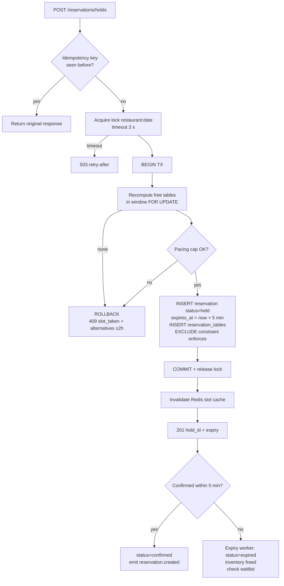
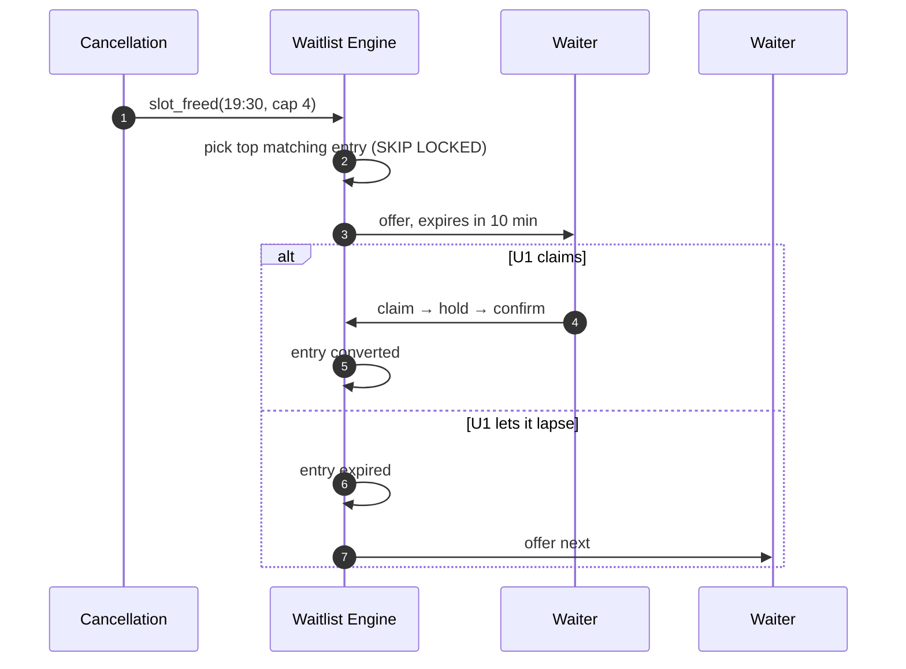

# SAHRA Blueprint — 05: Reservation System Design

*The engine is the product. Everything here assumes the schema in doc 04.*

---

## 1. Availability Model

Availability is **derived, never stored as truth**. The truth is: shifts (when the restaurant serves) + tables (physical capacity) + live reservations (what's taken). A slot `(restaurant, time T, party N)` is available iff at least one table or allowed combination with `min ≤ N ≤ max` is free for `[T, T + turn_time(N))`.

A Redis cache holds computed slot maps per `(restaurant, date)` with short TTL, invalidated on every write. Cache miss recomputes from PostgreSQL. This keeps availability reads (~100× more frequent than bookings) off the database.

## 2. Table Allocation Algorithm

Goal: seat the party while wasting the least capacity and preserving flexibility for future bookings (best-fit, not first-fit).

```text
function allocate(restaurant, T, party N):
    duration  = turn_time(restaurant, N)          // e.g. {1-2:90, 3-4:105, 5+:120} min
    window    = [T, T + duration)
    tables    = active tables with max_capacity >= N, ordered by:
                  (1) capacity_waste = max_capacity - N   ASC   // tightest fit first
                  (2) priority                            ASC   // restaurant preference
                  (3) zone match with seating_pref              // soft preference
    free      = tables minus tables having any live reservation overlapping window
                 (live = held | pending | confirmed | seated)

    if free not empty:
        return [free[0]]                                   // single-table best fit

    // combination fallback (2 tables max at MVP)
    for t1 in free_combinables:
        for t2 in t1.combinable_with where t2 free in window:
            if N <= t1.max + t2.max and N >= t1.min + t2.min:
                candidates.add([t1, t2], waste = t1.max + t2.max - N)
    return argmin_waste(candidates) or NO_AVAILABILITY
```

**Pacing check** runs after allocation: if confirmed covers starting in the same interval ≥ `pacing_limit`, the slot is refused even if tables are free — protecting the kitchen during iftar rushes.

## 3. Booking Flow & Double-Booking Prevention

Three defense layers:

1. **Advisory serialization (Redis or pg_advisory_xact_lock)** on `(restaurant_id, date)` — bookings for the same restaurant-day execute one at a time. A single restaurant's write rate (even iftar peak ≈ a few/sec) makes this serialization free in practice, and it makes reasoning trivial.
2. **Transactional re-validation** — inside the DB transaction, candidate tables are re-checked for overlap with `SELECT ... FOR UPDATE` on conflicting reservation rows.
3. **`EXCLUDE USING GIST` constraint** on `reservation_tables(table_id, during)` — the database physically rejects overlapping allocations. If layers 1–2 ever regress, the insert fails loudly instead of double-booking silently.



## 4. Hold Expiration

Holds give the diner 5 minutes to confirm (add requests, pay a deposit) without losing the slot.

- **Primary:** BullMQ delayed job per hold (`expire-hold`, delay = 5 min) — precise.
- **Backstop:** a sweeper runs every 60 s: `UPDATE reservations SET status='expired' WHERE status='held' AND hold_expires_at < now()` using the partial index — catches jobs lost to worker crashes.
- Confirmation re-validates `status='held' AND hold_expires_at > now()` inside its transaction, so an expired hold can never be confirmed (race between sweeper and confirm resolves via row lock — whoever commits first wins, the other sees the new status).

## 5. Waitlist Algorithm

Ordering: `priority DESC, created_at ASC` (FIFO within priority; loyalty tiers can raise priority later).

```text
on slot_freed(restaurant, window, capacity):
    loop:
        entry = SELECT * FROM waitlists
                WHERE restaurant_id=R AND status='waiting'
                  AND desired window overlaps freed window
                  AND party_size fits capacity
                ORDER BY priority DESC, created_at ASC
                LIMIT 1 FOR UPDATE SKIP LOCKED
        if none: create nothing; slot returns to public availability
        mark entry status='offered', offer_expires_at = now()+10min
        push + WhatsApp "table available — claim in 10 minutes"
        schedule offer-expiry job(entry, 10min)

on offer_expiry(entry):
    if status still 'offered': status='expired'; goto loop (offer next)

on claim(entry):
    runs the normal hold→confirm flow; entry status='converted'
```

`SKIP LOCKED` lets concurrent freed-slot events offer to *different* waiters without deadlocking. The freed slot is withheld from public availability during an active offer window (a `waitlist_hold` marker in Redis) so the waiter's 10 minutes are real.



## 6. Peak Hour Handling (Iftar = design peak)

- **Pacing caps** per restaurant throttle covers per 15-min interval.
- **Availability reads are cache-only during peaks**: Redis slot maps with 30 s TTL; recomputation is queued, not inline, when invalidation storms occur (debounced per restaurant).
- **Booking writes are naturally partitioned by restaurant** — the per-restaurant lock means no global contention; 500 restaurants booking simultaneously = 500 independent lock domains.
- **Queue absorbs fan-out:** notifications, analytics, search-index updates all go through BullMQ; the synchronous path is only lock → tx → commit.
- **Iftar anchor:** a daily job computes Maghrib time (Cairo prayer-time API/astronomical calc) and materializes Ramadan-mode shift times per restaurant, so the 18:00–18:45 stampede hits precomputed slot maps.
- **Load-shed order** if saturated: analytics events → recommendation refresh → search reindex → *never* booking commits or confirmations.

## 7. Concurrency, Transactions, Race Conditions

| Race | Prevention |
|---|---|
| Two diners, same last table | Per-restaurant-day lock serializes; loser gets 409 + alternatives |
| Book vs. modify overlapping the same table | Both go through the same lock + FOR UPDATE re-check |
| Confirm vs. hold-expiry sweeper | Row lock; status transition is compare-and-set (`WHERE status='held'`) |
| Walk-in entered by host vs. app booking | Walk-ins consume the same inventory through the same engine path |
| Waitlist double-offer | `FOR UPDATE SKIP LOCKED` on entry selection |
| Coupon over-redemption | `SELECT coupon FOR UPDATE`, check `redeemed_count < max`, increment in same tx |
| Payment webhook replay | Dedupe on `(provider, provider_txn_id)` unique index; handler idempotent |

**Transaction discipline:** all booking mutations are single short transactions (target < 50 ms) at `READ COMMITTED` + explicit locks (cheaper and sufficient given layer 1; `SERIALIZABLE` retry storms are avoided). Status transitions are guarded state machines — every `UPDATE` carries `WHERE status IN (...allowed_from...)` and bumps `version`.

## 8. Idempotency

- Every mutating client call sends `Idempotency-Key` (UUID v4, generated per user action, resent on retry).
- Server stores `(key → response hash)` — on `reservations.idempotency_key` unique index for bookings, Redis (24 h TTL) for other endpoints.
- Same key + same payload → replay stored response (200/201, not 409). Same key + different payload → `422 idempotency_conflict`.
- Payment intents mandate the key; Paymob order IDs derive from it, so a network-blip double-tap can never double-charge.

## 9. Retry Mechanisms

- **Client (Flutter/Dio):** retry idempotent GETs ×3 with jittered exponential backoff (250 ms → 2 s); retry mutations only with the same Idempotency-Key; surface offline queue for restaurant-console actions.
- **Server → third parties:** BullMQ jobs retry ×5 exponential (FCM, WhatsApp, Paymob queries); dead-letter queue with alerting; circuit breaker on payment gateway (fail fast + "pay at restaurant" fallback messaging).
- **Webhooks in:** at-least-once assumed; every handler idempotent; nightly reconciliation job diffs provider records vs. `payments`.

## 10. Booking Confirm — Pseudocode (authoritative)

```text
function confirm_reservation(hold_id, user, payload, idem_key):
    if cached := idempotency_lookup(idem_key): return cached

    with pg_transaction() as tx:
        r = tx.select_for_update(reservations, id=hold_id)
        assert r.user_id == user.id                     else 403
        assert r.status == 'held'                       else 409 hold_expired
        assert r.hold_expires_at > now()                else 409 hold_expired
        if restaurant.policy.deposit_required:
            assert payment_captured(r.deposit_payment_id) else 402
        tx.update(r, status = restaurant.booking_mode == 'request'
                              ? 'pending' : 'confirmed',
                  special_requests=payload.requests, version=r.version+1)
        tx.append(outbox, event='reservation.created', payload=r)   // transactional outbox
    // outbox relay publishes to BullMQ → notifications, search, analytics
    return idempotency_store(idem_key, 200, r)
```

The **transactional outbox** is the glue: events are written in the same transaction as the state change, then relayed to queues — so a crash can never confirm a booking without its notifications, or vice versa.
