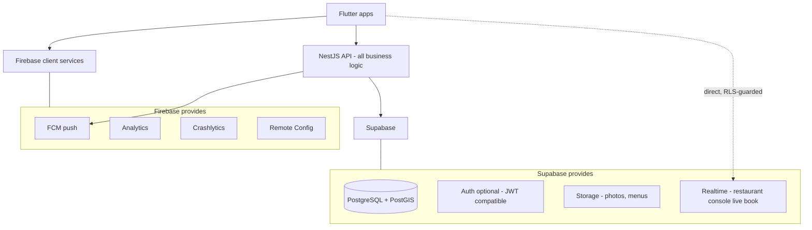

# SAHRA Blueprint — 08: Technology Stack Recommendation

---

## 1. Backend Architecture Options

Scoring 1–5 (5 best) against SAHRA's needs. The decisive requirement: **a reservation engine needs relational transactions, row locks, and range-exclusion constraints** — this alone disqualifies document stores as the system of record.

| Criterion | 1. Firebase only | 2. Supabase only | 3. NestJS + Firebase | 4. NestJS + Supabase | 5. NestJS + Supabase + Firebase | 6. Custom + PostgreSQL (self-managed) |
|---|---|---|---|---|---|---|
| Dev speed (MVP) | 5 | 4 | 3 | 3 | 3 | 2 |
| Reservation-engine suitability | 1 | 3 | 2 | 5 | 5 | 5 |
| Scalability to 1M users | 3 | 3 | 3 | 4 | 4 | 5 |
| Security control | 3 | 4 | 4 | 5 | 5 | 5 |
| Cost at scale | 2 | 4 | 2 | 4 | 4 | 3 (infra cheap, people expensive) |
| Vendor lock-in risk | 1 (worst) | 4 | 2 | 4 | 4 | 5 |
| Long-term maintenance | 3 | 3 | 3 | 4 | 4 | 3 |
| Complexity | 5 (lowest) | 4 | 3 | 3 | 3 | 1 (highest) |

**Option 1 — Flutter + Firebase only.** Fastest demo, fatal foundation: Firestore has no multi-document range-overlap constraints, no true relational queries — preventing double-booking means transaction gymnastics that get worse forever; analytics/reporting (owner dashboards!) are miserable; costs balloon with read-heavy availability checks; total lock-in. *Reject.*

**Option 2 — Flutter + Supabase only.** Real PostgreSQL + auth + storage + realtime + RLS — impressive reach. But complex booking logic ends up in Edge Functions + database functions: hard to test, version, and observe; no place for queues, pacing logic, payment orchestration. Fine for a prototype, ceiling appears fast. *Reject as final, acceptable for week-1 spike.*

**Option 3 — NestJS + Firebase.** Proper application layer but Firestore's data-model weaknesses remain underneath the one component that most needs SQL. *Reject.*

**Option 4 — NestJS + Supabase.** Real backend + real PostgreSQL. Everything the engine needs. Missing only best-in-class push/crash/analytics tooling — which Firebase gives away free. *Strong.*

**Option 5 — NestJS + Supabase + Firebase (hybrid). ✅ RECOMMENDED.** Option 4, plus Firebase used *only for its unbeatable free clients*: FCM, Analytics, Crashlytics, Remote Config. No Firestore, no Firebase Auth — so lock-in is confined to commodity, swappable services.

**Option 6 — Custom backend + self-managed PostgreSQL.** Maximum control, but at MVP you'd be rebuilding auth flows, storage, backups, and realtime that Supabase gives you managed. This is the *destination* (the Enterprise stage migrates to self-run Postgres/RDS), not the starting point.

### The recommended hybrid, explicitly

**Why it works:** every service does the one thing it's best at; the NestJS layer owns all business logic so no logic is trapped in a vendor. **Data flow:** Flutter talks REST to NestJS for everything transactional; subscribes to Supabase Realtime (RLS-guarded, read-only channels) for live reservation-book updates; Firebase SDKs handle telemetry client-side. **Security:** single JWT issuer (NestJS), RLS as second wall for any direct-read channel, service keys only server-side. **Cost:** ~$100–150/mo at MVP (Supabase Pro $25, small ECS/Fly instances, Redis, Meilisearch micro, Firebase free tier). **Scalability:** each piece scales or swaps independently — Supabase → RDS is a pg_dump away because it's *just Postgres*. **Maintenance:** one backend codebase, managed data services, no Kubernetes until it's earned.

## 2. Backend Framework

| | Node.js + NestJS | ASP.NET Core | Spring Boot | Go |
|---|---|---|---|---|
| Raw performance | 3 | 5 | 4 | 5 |
| Scalability | 4 | 5 | 5 | 5 |
| Productivity for this team | 5 | 3 | 3 | 3 |
| Ecosystem for marketplace needs | 5 (Prisma, BullMQ, Paymob SDKs, Stripe-class libs) | 4 | 4 | 3 |
| Hiring pool (Egypt) | 5 — deepest JS/TS market | 4 | 4 | 2 |
| Learning curve | Low | Medium | Medium-high | Medium |
| Flutter integration | Excellent (OpenAPI codegen, shared JSON idioms) | Good | Good | Good |
| Cost | Low | Low-med | Med (JVM memory) | Lowest compute |

**Recommendation: NestJS (TypeScript).** An I/O-bound booking API doesn't need Go's raw throughput at any stage SAHRA will reach before a rewrite would be affordable anyway; NestJS's modular architecture, decorator-driven OpenAPI, DI, and Egypt's deep TypeScript talent pool make it the productivity winner. Carve out a Go microservice later only if a hot path (e.g., availability computation) ever needs it.

## 3. Database

| | PostgreSQL | MySQL | MongoDB | Firestore | Supabase PG |
|---|---|---|---|---|---|
| ACID / transactions | 5 | 5 | 3 | 2 | 5 |
| Relational + complex queries | 5 | 4 | 2 | 1 | 5 |
| Analytics/reporting | 5 | 4 | 3 | 1 | 5 |
| Range-exclusion constraints (anti-double-book) | **5 (unique)** | 2 | 1 | 1 | 5 |
| Geo queries | 5 (PostGIS) | 3 | 4 | 3 | 5 |
| Scalability | 4 | 4 | 5 | 4 | 4 |
| Real-time | 3 (LISTEN/NOTIFY) | 2 | 4 | 5 | 5 (built-in) |
| Cost/maintenance | 4 managed | 4 | 3 | 2 at scale | 5 |

**Recommendation: PostgreSQL via Supabase.** `EXCLUDE USING GIST` on time ranges, PostGIS, JSONB flexibility, and mature managed hosting. MySQL lacks range exclusion; MongoDB/Firestore lack the relational-transactional core the engine demands.

## 4. BaaS Deep-Dive

**Firebase** — Auth: polished, but locks identity to Google and complicates SQL joins with user data (*skip*). Firestore: *skip* (above). Cloud Functions: cold starts + vendor-tied (*skip*). Storage: fine but Supabase Storage keeps files next to the DB ACLs (*skip*). **FCM: use — the only free, reliable, cross-platform push service.** **Analytics/Crashlytics/Remote Config: use — free, best-in-class, client-side only.** Net: Firebase as a *client-services toolbox*, never as the data platform.

**Supabase** — PostgreSQL: full-power managed PG with extensions (PostGIS, pg_cron). Auth: GoTrue is solid and optional — we issue JWTs from NestJS but can delegate social flows. Storage: S3-compatible with RLS-aware policies — use for photos/menus. Realtime: WebSocket changefeeds — perfect for the live reservation book. Edge Functions: skip (logic lives in NestJS). RLS: excellent second defense wall for any direct client reads. Cons: smaller company risk (mitigated: it's open-source Postgres — exportable in an afternoon), connection limits (use PgBouncer/Supavisor + Prisma pool tuning).

## 5. Final Stack

| Layer | Choice |
|---|---|
| Mobile/web clients | Flutter (customer, restaurant console, admin web) |
| API | NestJS (TypeScript, modular monolith) + Prisma |
| Database | Supabase PostgreSQL (+PostGIS, partitioning) |
| Cache/locks/queues | Redis (ElastiCache/Upstash) + BullMQ |
| Search | Meilisearch (typo-tolerant Arabic/English; upgrade path: Elasticsearch/Typesense) |
| Storage/CDN | Supabase Storage → CloudFront/Cloudflare |
| Push/telemetry | Firebase FCM, Analytics, Crashlytics, Remote Config |
| Messaging | WhatsApp Business API (via Twilio/360dialog) + SMS fallback |
| Payments | Paymob (cards, wallets, kiosk) + Fawry; Apple Pay later |
| Hosting | MVP: Fly.io/Railway or ECS Fargate → Growth: ECS → Enterprise: EKS |
| Observability | Sentry + Grafana Cloud (Prometheus/Loki) |
