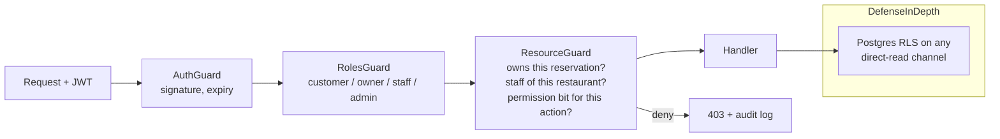
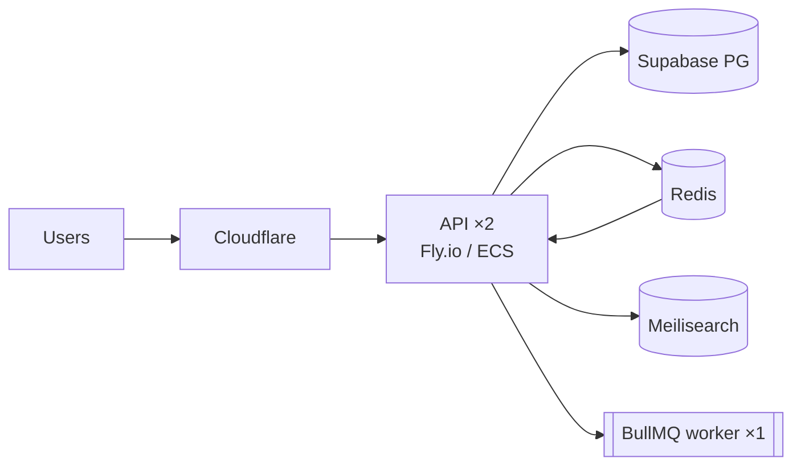
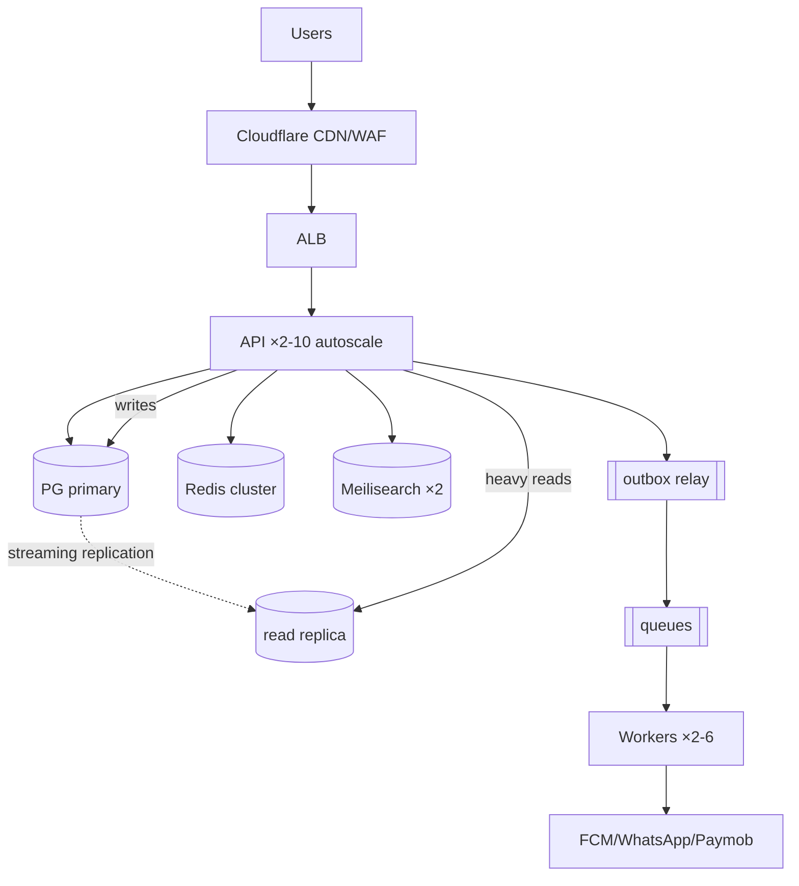
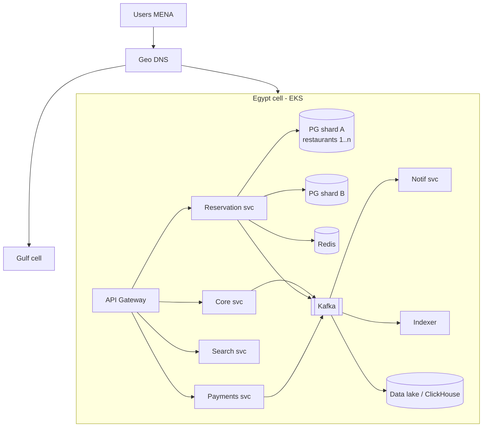

# SAHRA Blueprint — 09: Security & Scalability Architecture

*Covers blueprint sections 9 and 10.*

---

## 1. Security Architecture

### 1.1 Authentication & JWT

- Password hashing: **argon2id**; phone OTP hashed in Redis, 5-min TTL, 5 attempts, per-phone and per-IP rate limits (blocks SMS-pumping fraud — a real cost attack in Egypt).
- **Access JWT 15 min** (RS256, kid-rotated keys) / **refresh token 30 d, rotating with reuse detection** — a replayed old refresh token revokes the whole token family.
- Device binding: refresh tokens tied to device records; "log out all devices" supported.
- Step-up auth (re-OTP) for: payment method changes, owner payout details, staff-role grants.

### 1.2 Authorization (RBAC + resource guards)

Roles: `customer`, `owner`, `staff(restaurant_id, role, permissions)`, `moderator`, `support`, `admin`. Admin actions require allow-listed origins + hardware-key 2FA + full audit logging (immutable `audit_logs`).

### 1.3 Application & Network Security

| Threat | Control |
|---|---|
| SQL injection | Prisma parameterized queries only; no string-built SQL; CI lint bans `$queryRawUnsafe` |
| XSS/into-webviews | Output encoding; CSP on admin web; no HTML from user content (reviews are plain text) |
| Rate abuse / brute force | Redis sliding-window per user+IP+endpoint (limits in doc 06); CAPTCHA (hCaptcha) after anomalies |
| DDoS | Cloudflare in front of everything (WAF, bot management, L7 rules); ALB + autoscaling absorbs residual |
| Transport | TLS 1.3 everywhere; HSTS; certificate pinning in apps (with remote kill switch) |
| Data at rest | RDS/Supabase AES-256 encryption; column-level encryption (pgcrypto) for tokens/IDs of payment methods |
| Secrets | AWS Secrets Manager / Doppler; injected at deploy; never in code, images, or Dart bundles; 90-day rotation; least-privilege IAM per service |
| Mobile | Obfuscation, secure storage for tokens, root/jailbreak signal → step-up for payments, no client-side secrets |

### 1.4 Payments — PCI scope minimization

SAHRA never touches PANs: Paymob-hosted fields/SDK tokenize on device → SAHRA stores tokens only → **PCI DSS SAQ-A** scope. Webhooks HMAC-verified, amount re-checked server-side, idempotent handlers, nightly reconciliation. Refund authority: dual-control above threshold amounts.

### 1.5 Privacy — Egypt PDPL (Law 151/2020) + GDPR-grade posture

Lawful-basis register; explicit consent for marketing; data minimization (no national ID, no precise home location); right-to-access/erasure implemented as export + PII anonymization (reservations keep statistical shell, lose identity); data-residency note: keep primary region eligible for MENA (me-south-1/eu-central-1) and document cross-border transfer basis; DPO named before public launch; breach-notification runbook (72 h).

## 2. Scalability Architecture

### 2.1 Stage 1 — 0–10k users (MVP)

**Modular monolith, 2 app instances, managed everything.** Supabase PG (Pro), one Redis, Meilisearch micro, BullMQ workers in the same deployment. This comfortably serves 10k users (~tens of bookings/min peak). Cost ≈ $150–300/mo.

### 2.2 Stage 2 — 100k users (Growth)

Same monolith, scaled out — **no microservices yet**:

- API autoscaled 2→10 tasks behind ALB; workers separated into their own service.
- **PG read replica**: search enrichment, analytics, owner dashboards read from replica.
- Redis cluster-mode; availability caching becomes mandatory, not optimization.
- Partitioning of `reservations`/`notifications` by month begins.
- CDN for all media + API edge caching of restaurant profiles (60 s, stale-while-revalidate).
- Transactional outbox + event topics formalized (still BullMQ/Redis Streams).

### 2.3 Stage 3 — 1M+ users (Enterprise / multi-country)

Extract services **only along proven pain lines**, event-driven backbone:

- **Extracted microservices:** Availability+Reservations (the hot core, possibly its own DB), Search, Notifications, Payments, Analytics. Everything else stays in the "core" service.
- **Kafka (MSK)** replaces Redis Streams as the event backbone; consumers: search indexer, analytics lake (S3 + Athena/ClickHouse), notification fan-out, fraud scoring.
- **Database:** move to self-managed RDS/Aurora if Supabase limits bite; **shard by restaurant_id** (booking domain) and user_id (identity domain); per-country cells for MENA expansion (Egypt cell, UAE cell, KSA cell — data residency + latency + blast-radius isolation).
- Kubernetes (EKS) once service count > ~5 justifies it; multi-AZ mandatory, multi-region DR.

### 2.4 Scaling Principles

1. Availability reads scale in Redis/CDN; booking writes scale by *restaurant-partitioned* locks — the workload shards naturally.
2. Never introduce a distributed transaction: every booking is single-restaurant, hence single-shard, by design.
3. Microservices are extracted, not designed up-front; each extraction must retire a measured bottleneck.
4. Queues between every external dependency and the request path.
5. Ramadan capacity plan: load-test 10× baseline every Sha'ban (month before); pre-scale schedules for iftar hours instead of reactive autoscaling alone.
