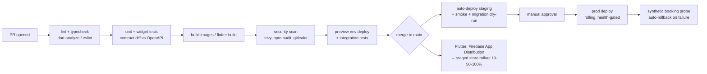

# SAHRA Blueprint — 10: DevOps, Roadmap, Maintenance & CTO Recommendation

*Covers blueprint sections 11, 13, 14, and 16.*

---

## 1. DevOps & Deployment (Section 11)

**Containers:** Docker multi-stage builds (node:22-alpine, distroless runtime, non-root). **Orchestration:** ECS Fargate at MVP/Growth (Kubernetes is deferred until the Enterprise stage — a 2-person backend team should not be running EKS). **IaC:** Terraform from day 1 (VPC, ECS, RDS/Supabase config, Redis, IAM).

### CI/CD — GitHub Actions

Database migrations: Prisma Migrate, expand-and-contract pattern (never breaking in one release), reviewed like code, applied before deploy with automatic backout plan.

**Monitoring & operations:** Prometheus/Grafana (RED metrics per endpoint; business metrics: bookings/min, hold-conversion, no-show marks), Loki structured JSON logs with `request_id` correlation, Sentry both sides, UptimeRobot/Checkly synthetic probe that books+cancels at a fake restaurant every 5 min. Alerts → PagerDuty-style rotation (founders at MVP). **Backups:** PG PITR + nightly snapshots, 30-day retention, cross-region copy, **quarterly restore drill**; S3 versioning. **DR:** RPO ≤ 5 min (WAL), RTO ≤ 4 h at MVP → ≤ 1 h at Growth; runbook per failure class (DB failover, region loss, payment-gateway outage → cash-mode fallback).

## 2. Development Roadmap (Section 13)

Team costs assume blended Cairo senior rates (~$2–4.5k/mo — an Egypt cost advantage; Strategy Book: MVP launch Month 5 is a hard date).

| Phase | Timeline | Deliverables | Team | Key risks | Est. cost |
|---|---|---|---|---|---|
| **1. Requirements & foundation** | Wk 1–4 | Final PRD from this blueprint; 15 restaurant discovery interviews; KPI tree; domain model sign-off | Founder/PM, tech lead, designer (part) | Scope creep — freeze MVP list (doc 01 §4.1) | $8–12k |
| **2. UI/UX design** | Wk 3–8 (overlaps) | Design system (build on `sahra-design-system-v1`), ar+en flows for 3 surfaces, clickable prototype, usability tests with 5 diners + 3 hostesses | Product designer, PM | RTL treated as afterthought; hostess UX untested in real service | $6–10k |
| **3. Backend development** | Wk 5–16 | NestJS modules, reservation engine + tests, DB + migrations, APIs per doc 06, admin basics, staging env, CI/CD | 2 backend, tech lead, (devops part-time) | Engine correctness — allocate 2 wks for concurrency test harness | $30–45k |
| **4. Flutter development** | Wk 7–18 | Customer app + restaurant console + admin web (MVP scope), offline console cache, push/WhatsApp, ar/en | 2–3 Flutter devs | Console adoption UX; mid-range Android performance | $30–50k |
| **5. Testing & hardening** | Wk 17–20 | Integration + load tests (10× iftar peak), security review + pen test, beta with 10 restaurants in Zamalek, bug bash | Whole team + QA contractor | Double-booking edge cases; real-world connectivity | $8–15k |
| **6. Deployment & launch prep** | Wk 19–21 | Prod infra (Terraform), store approvals, monitoring/alerts, support playbooks + WhatsApp support line, onboarding kit for restaurants | DevOps + PM | App Store review delays — submit early | $5–8k |
| **7. Launch (Month 5)** | Wk 22–26 | Public launch Zamalek+Maadi, 30–50 live restaurants, influencer dinners, restaurant success manager hired (before launch) | All + RSM + marketing | Cold-start liquidity — density before breadth | $15–25k (incl. marketing) |
| **8. Scaling (Mo 7–18)** | ongoing | v1.1: payments/deposits, waitlist, reviews, referrals, Pro analytics tier; Ramadan campaign; 100+ restaurants; Growth architecture (doc 09 §2.2) | +1 backend, +1 Flutter, data analyst | Ramadan peak readiness; churn of early restaurants | $25–40k/quarter |

**Total to launch: roughly $100–165k** (lean Cairo team, 5–6 months). Add ~30% buffer for the pre-seed ask.

## 3. Maintenance Plan (Section 14)

- **Monitoring/logging:** as §1; weekly ops review of error budgets (99.9% booking API SLO), slow-query report, queue-depth trends.
- **Security updates:** Dependabot/Renovate weekly; CVE triage SLA 48 h critical; quarterly access review; annual pen test.
- **Database:** monthly `pg_stat_statements` tuning pass; autovacuum tuning on `reservations`; partition rollout & archival job; quarterly restore drill.
- **Backups/DR:** per §1; documented, drilled.
- **Incident management:** SEV1–3 ladder, on-call rotation, 30-min SEV1 acknowledgment, blameless postmortems within 72 h, public status page.
- **Release strategy:** backend continuous (behind flags); mobile biweekly release train; hotfix lane; staged rollouts 10→50→100% gated on crash-free ≥ 99.7%.
- **Feature rollout:** Remote Config flags; percentage + cohort targeting (e.g., Ramadan features to Egypt only); every flag has an owner and removal date.
- **Versioning:** SemVer for API spec + apps; `/v1` contract frozen by contract tests; force-upgrade mechanism reserved for security/compat breaks.

## 3b. Images — pipeline, and the manual cost we are carrying

**Storage:** Supabase Storage. Same vendor as Postgres, so no new account, no
new bill, and the files sit next to the ACLs that govern them. Free tier is
1 GB stored and 5 GB egress per month; five venues at twenty photos each is
roughly 30 MB stored, and at a few MB per browsing session 5 GB covers on the
order of a couple of thousand sessions a month. The next tier is $25/month for
100 GB / 250 GB and we should not need it before real usage.

**Resize on UPLOAD, never on display.** `sharp` writes three fixed widths —
160 (search rows, booking cards), 400 (cards, hero on a phone), 1200 (venue
hero) — as WebP. The client asks for the smallest that fits the slot.
Originals are kept, in a bucket path the app never requests, so a re-crop or a
fourth size later does not mean re-collecting photos from restaurants.

No paid image-transformation feature is used, and nothing resizes on a request
path. An image transformed per view is an image paid for per view, and the
free tier is the constraint that keeps that honest.

### THE UPLOAD PATH IS MANUAL, AND IT SCALES LINEARLY WITH VENUES

R-2.2 — "photo upload with ordering, cover photo" — is an **owner-facing P0
with no owner-facing surface to put it on.** `management_app` does not exist
and is not scheduled. So until it does, photos reach the platform through an
admin endpoint and a seed script that **we** run.

In plain terms: **onboarding a restaurant means one of us collects their
photos, checks them, and uploads them.** Nobody at the venue can do it. At five
pilot venues that is an afternoon. At fifty it is somebody's job, every week,
for as long as venues keep joining and keep changing their menus and rooms.

**This is the first thing that will make the management app urgent ahead of
schedule.** Not the reservation book, not the floor plan — photo upload, because
it is the one task that recurs per venue and cannot be batched away. The
sentence is written down here so the fiftieth venue is not a surprise: when
onboarding starts costing more than an afternoon a week, the answer is not more
hours, it is R-2.2 in `management_app`.

Recorded 2026-08-08, accepted with eyes open by the product owner.

## 4. CTO Recommendation (Section 16)

**What I would personally build:** exactly the hybrid in doc 08 — Flutter (three surfaces, one design system) → NestJS modular monolith → Supabase PostgreSQL + Redis + BullMQ + Meilisearch, Firebase confined to FCM/Analytics/Crashlytics/Remote Config, Paymob+Fawry for money, WhatsApp as the messaging backbone, ECS Fargate + Terraform, Cloudflare in front. Boring, correct, and cheap — every exotic choice deferred until a measured bottleneck earns it.

**Technologies I would avoid, and why:**

- *Firestore as system of record* — no relational integrity for a booking engine; you will fight it forever and pay per-read for the privilege.
- *Microservices at MVP* — a 4-person team operating 8 services ships nothing; the monolith with clean module boundaries gives you the extraction seams for free.
- *Kubernetes before ~Stage 3* — undifferentiated ops burden.
- *MongoDB for bookings* — overlapping-interval integrity is the one thing document stores can't give you.
- *GraphQL at MVP* — resolver complexity + caching pain for three first-party clients that you fully control; REST + OpenAPI codegen is faster and safer here.
- *Home-rolled auth crypto, raw card storage (never), SMS-only OTP without WhatsApp* (cost + deliverability in Egypt), *per-cover pricing* (strategic, not technical: it's the incumbent's weakness — don't import it).

**Stage architecture & migrations:**

| Stage | Architecture | Migration trigger & path |
|---|---|---|
| **MVP 0–10k** | Modular monolith ×2, Supabase, single Redis, workers co-deployed | — |
| **Growth 10k–100k** | Same code; autoscaled API, separate worker fleet, PG read replica, Redis cluster, partitioning, outbox events | Trigger: P95 latency creep / replica-worthy read load. Path: infra-only change — no rewrite, because module boundaries and outbox were built at MVP. |
| **Enterprise 100k–1M+** | Extract Reservation, Search, Notification, Payments services; Kafka backbone; shard by restaurant_id; country cells (Egypt/UAE/KSA); EKS; possibly RDS/Aurora | Trigger: team > ~15 engineers, multi-country launch, or engine contention. Path: strangler-fig — outbox events already define the service contracts; move one module at a time behind the same gateway; dual-write + shadow-read during each cut-over; sharding preceded by the partition keys already in the schema. |

**How I'd run it:** hire 2 senior backend + 2 Flutter + 1 designer and a founding PM; spend the first two weeks on the reservation engine's concurrency test harness before any UI exists (the engine is the company); instrument LTV:CAC and no-show rate from day 1; defend the Month-5 launch date by cutting scope, never quality of the booking path; and treat Ramadan as your Super Bowl — every year, the platform that survives iftar owns the market.
