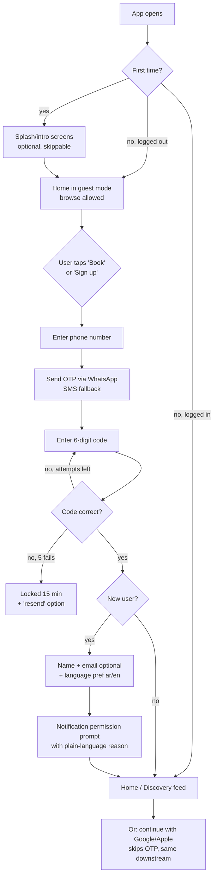
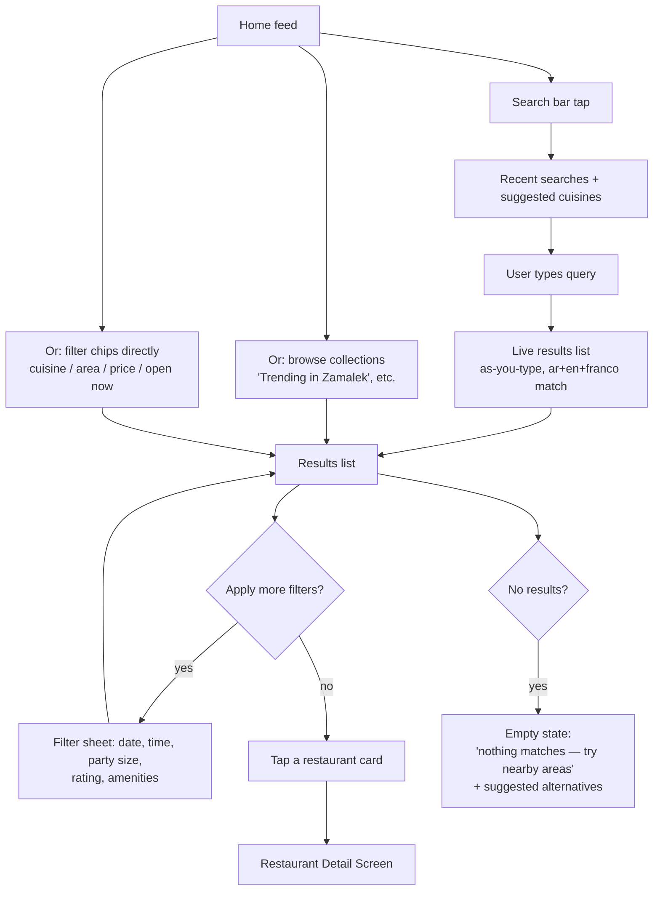
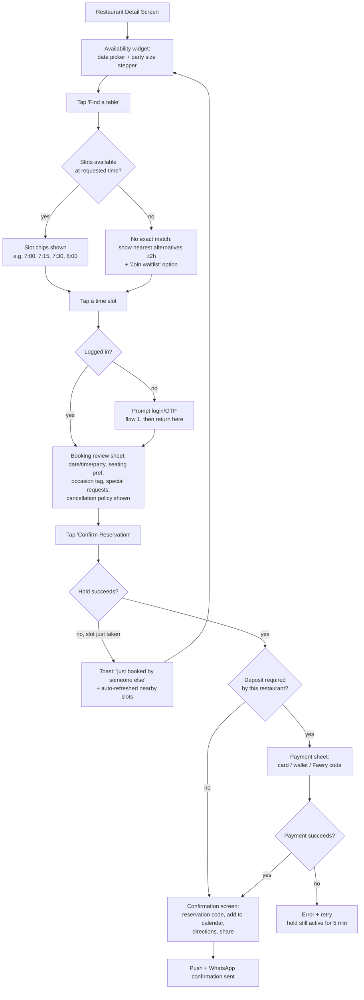
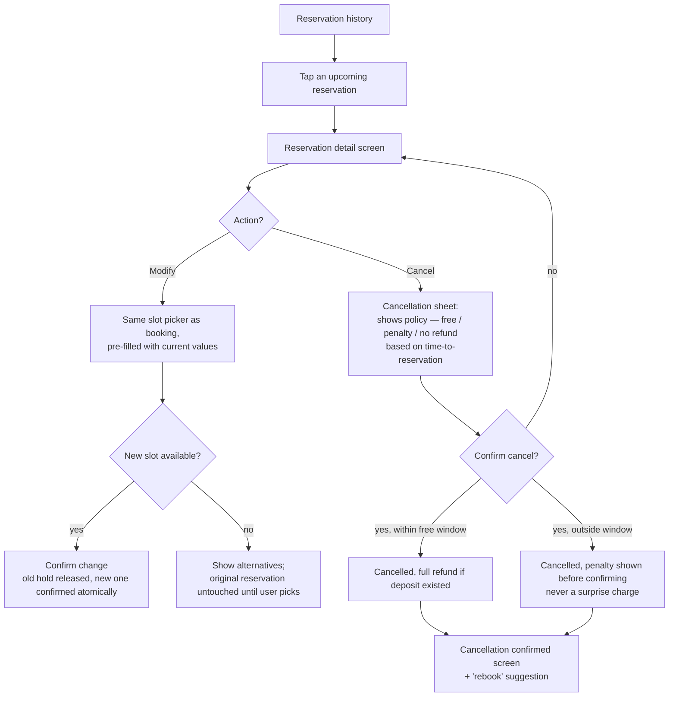
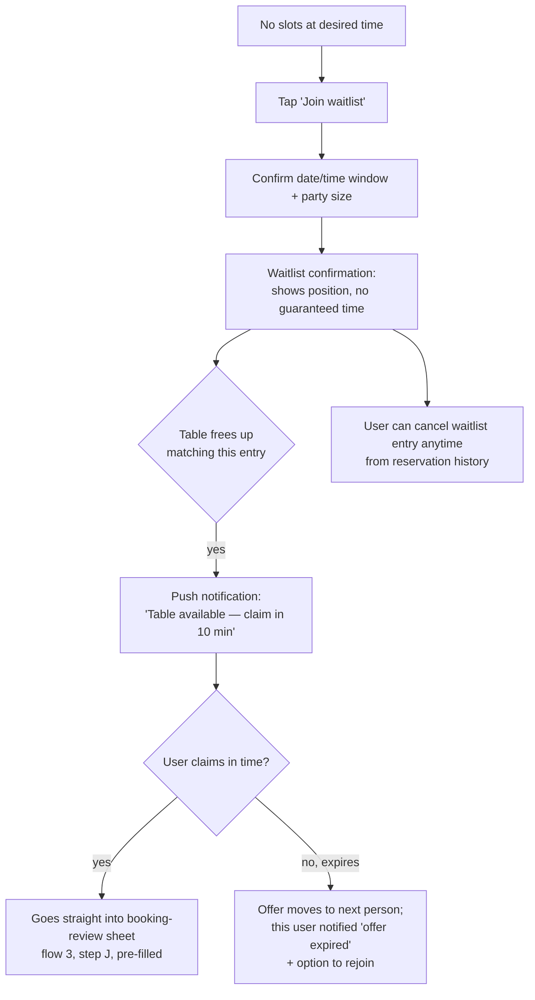
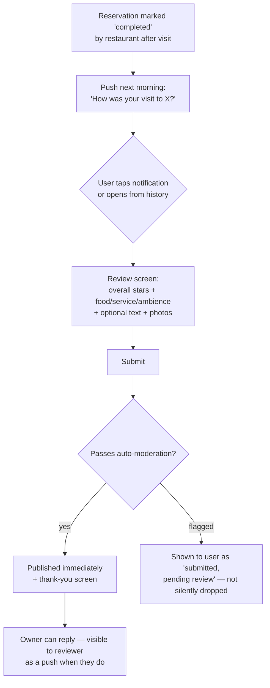

# SAHRA Blueprint — 11: User Flows — Customer App

*Screen-by-screen journeys, not backend sequence diagrams (those are in `03-system-architecture.md`). This is what the person actually sees and taps, in order, including empty states and failure paths. Restaurant management app flows come in a follow-up doc once we finish discussing that app's features.*

---

## 1. Onboarding & Registration

**Notes:**
- Guest browsing is allowed all the way to the booking button — we don't gate discovery behind login, only the actual reservation (reduces drop-off).
- Social login (Google/Apple) and phone/OTP both terminate at the same "new user profile" step — no duplicate accounts if email matches an existing phone account (merge prompt if detected).
- Notification permission is asked with context ("so we can remind you before your reservation"), not immediately on app open — asking cold gets rejected more.

## 2. Search & Discovery

**Restaurant Detail Screen contents (top to bottom):** cover photo carousel, name (ar/en), rating + review count, cuisine tags, price band, neighborhood + map pin + distance, availability widget (see flow 3), amenities icons, menu tab, photos tab, reviews tab, policies (cancellation window, deposit if any), "Save" heart icon.

## 3. Core Booking Flow — the flow that matters most

**Failure/edge states worth designing explicitly, not as an afterthought:**
- Hold expires while user is filling the review sheet (5-min window per `05-reservation-engine.md`) → sheet shows a countdown in the last minute, and on expiry re-runs availability instead of a dead-end error.
- No slots at all for the date → don't just show "no availability", offer the waitlist join and/or nearby similar restaurants with availability at that time.
- Party size exceeds what any table combination supports → explain why ("max party size for this restaurant is 10") rather than a generic error.

## 4. Modify / Cancel Reservation

## 5. Waitlist (customer side)

## 6. Post-Visit / Review

**Constraint carried from the schema:** one review per completed reservation, and the review prompt only fires for reservations with `status = completed` — never for cancelled or no-show reservations.

---

**Next up (once we finish discussing this app's features):** the restaurant management app flows — owner onboarding, daily reservation-book operation, walk-in entry, and the admin approval flow living inside the same app.
